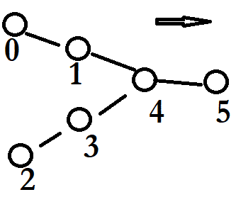

# Chinampas:
Code for the paper https://arxiv.org/abs/2103.15265


## Contents


* **Project Titles**
  - Chinampas is a library to efficiently compute cascades of activations on a nonlinear signal-flow tree when the condition of nonlinearity is sum of inputs signals > a threshold. (Distance between nodes is fixed, intensity of signals is one and threshold is two.)


* **Overview**
  - We didn't find many studies of non linear signal flow graphs, despite the fact they are used to describe the [cardio vascular system](https://en.wikipedia.org/wiki/Signal-flow_graph#:~:text=Nonlinear%20flow%20graphs) and occur on the study of neural networks (artificial and biological).
  - Supposed that your experiment is modeled by a tree (graph). You can force some nodes to fire, or if the nodes receive two signals, then the nodes fire. Every node can send a signal to the node to the right or to itself.  Given a particular input, how do you predict if a certain node will fire at a fixed time?
  - A chinampa is a space time representation of the flow of signals in a tree. A chinampa over a line with several nodes looks like the figure below in which the vertical axis is time, and each column has black nodes if that node fired at that time.

  

  Zooming out, we see chains of isoceles right triangles of different size but all looking at the same direction, stacked into each other.

  Zooming in, we see cellular automata following rule 192.

  - We found an algorithm that reproduce the cascades of activations efficiently, our algorithm has time complexity O(n) in the best scenario and O(n^2) in the worst scenario (which is the time complexity of making every computation).

  - Will a vertex be activated at a particular time given a certain input?
    We wrote a function that answers this questions efficiently [chinampas](chinampa/chinampa.py).
    
  - We show that a subfamily of Chinampas is closely related to certain polytopes studied in Ehrhart theory.

* **Example Usage**: 
For chinampas in a line:
```python
from chinampas import chinampa as ch
activations = [[0,0],[1,0],[4,4],[5,4],[6,4],[7,5]]
chain = ch.Chain_Chinampa(activations)
print(f" Will vertex 7 at time 6 be activated?  {chain.will_vertex_be_activated(7,6)} ")
print(f"list of pyramids in the chinampa: {[(pyramid.lP,pyramid.rP,pyramid.time) for pyramid in chain.pyramids]}")
```
For chinampas in a tree:


```python
from chinampas import chinampa as ch
tree = ch.Tree_Chinampa(0,{0:{'activations':[[4,0],[5,0]],'branches':[1,2]},
                           1:{'activations':[[0,0],[1,0]],'branches':[]},
                           2:{'activations':[[2,2],[3,2]],'branches':[]}
                           }
                       )
print(f"if we activate the vertices 0,1, 4, 5 at time 0, the vertices 2,3 at time 2, ")
print(f" will the vertex 5 be activated at time 5? {tree.will_vertex_be_activated(5,5)}, how about at time 6? {tree.will_vertex_be_activated(5,6)}") #The node index is global i.e, node 0 is in branch 1, node 2 in branch 2, etc. -Luke
#On each branch, the vertex labels are consecutive and decrease as we traverse down the tree.
```
Here we assume the underlying tree:

  

   

* **Getting Started**
  - installation
    Clone this repo:
 
    git clone https://github.com/mendozacortesgroup/chinampas.git
    cd chinampas
  - prerequisites
    python >=3.7
    numpy >= 1.21.4 

  - location of:
    - code: [chinampas](chinampas)
    - issue tracker
    - notes: A Jupyter notebook explaining the paper is located at  [Notebook](Chinampas.ipynb). A Mathematica notebook explaining the calculations is located at [mathematica notebook](Introduction.nb) (or the pdf [introduction](introduction.pdf) ). Also [a pdf](R7.pdf) and the mathematica [code](Computation_of_R7.nb) with our calculations to determine the generating series of the triangular sequence R7     
    - beta : A [python program](chinampa/profit.py) to find those chinampas of profit 0.


* **Developer info**
  - Limitations and known issues
    In this version, the topology of the tree is fixed, the distance between nodes is fixed, the intensity of signals is one and the threshold of every node is two.   


* **Colophon**
  - Credits -- code and algorithm: Luke Van Popering, Eric Dolores Cuenca and Antonio Arciniega-Nevarez.
  - Copyright and License -- see [LICENSE](LICENSE) file.
  - How to contribute: we will study more general graphs with less restrictions, you are welcome to help us with code. We also want to find more use cases.
  - This project has received funding from the National Research Foundation of Korea (NRF) grant funded by the Korea government (MSIT) (No. 2020R1C1C1A01008261).
  - References:  https://arxiv.org/abs/2103.15265
